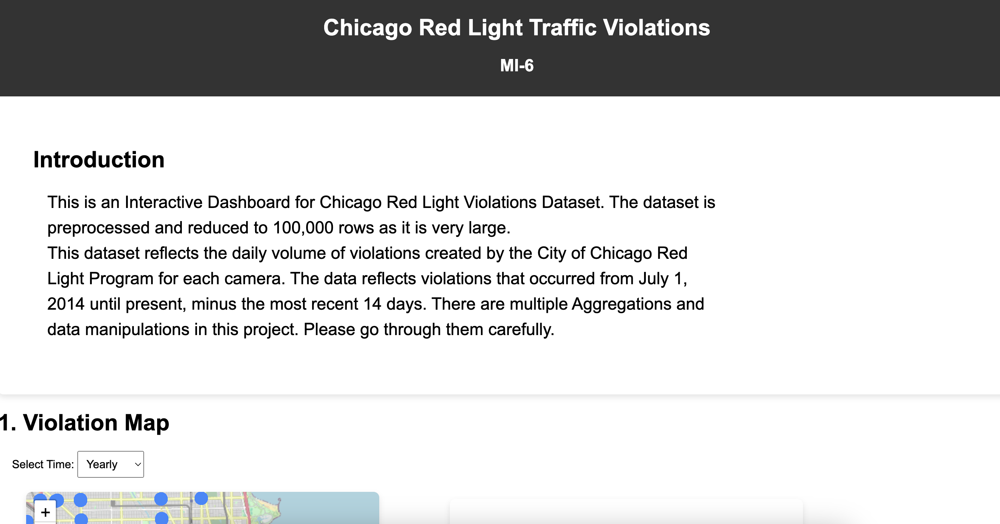
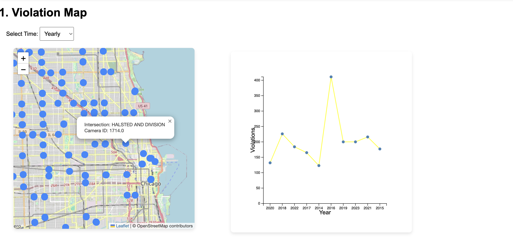
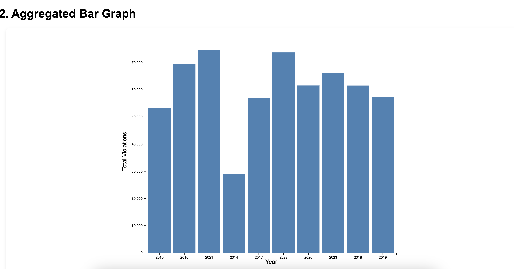
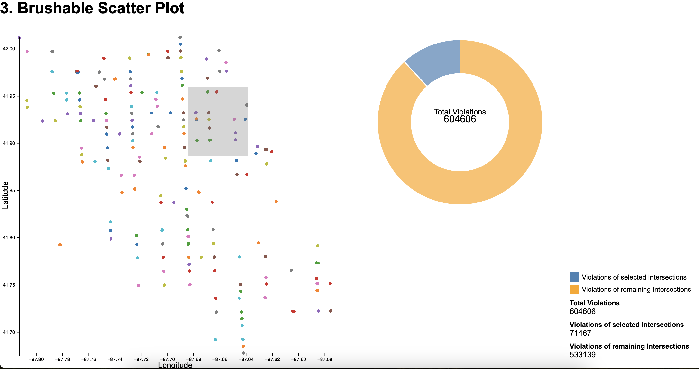
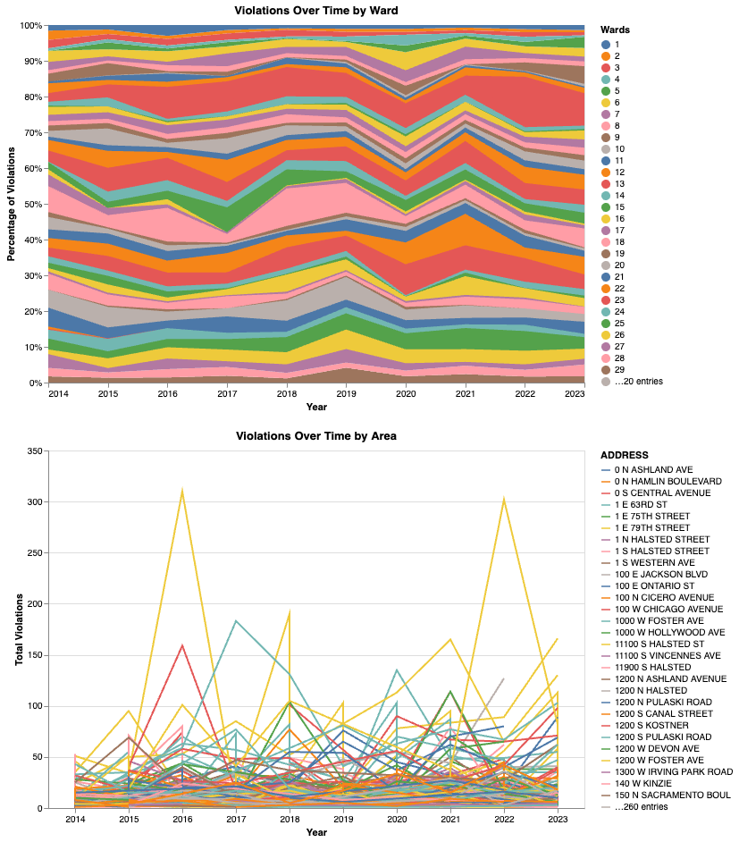
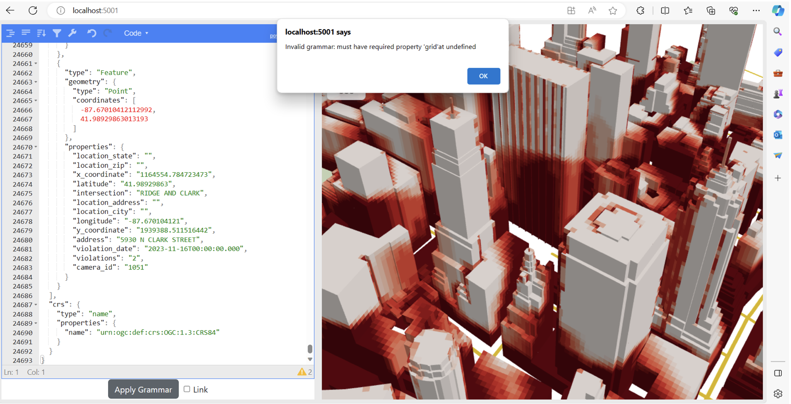
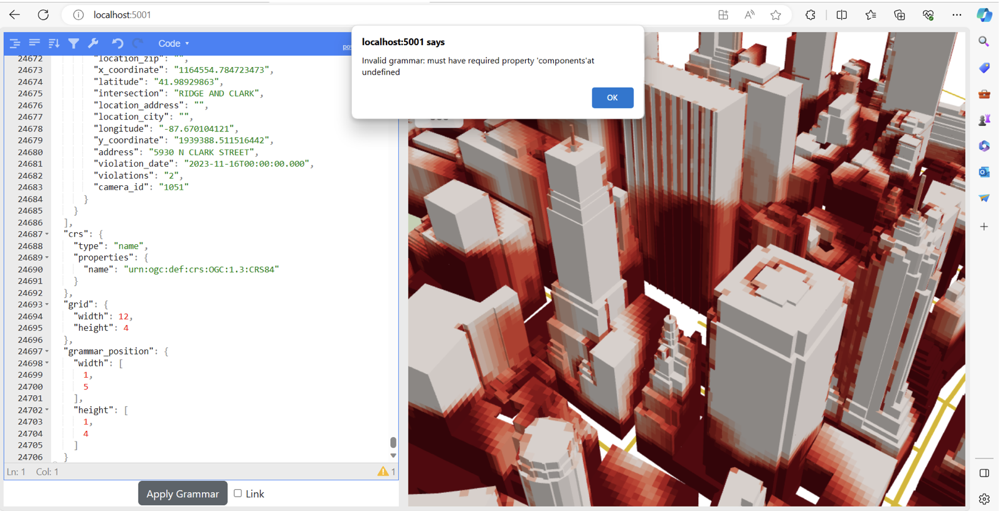
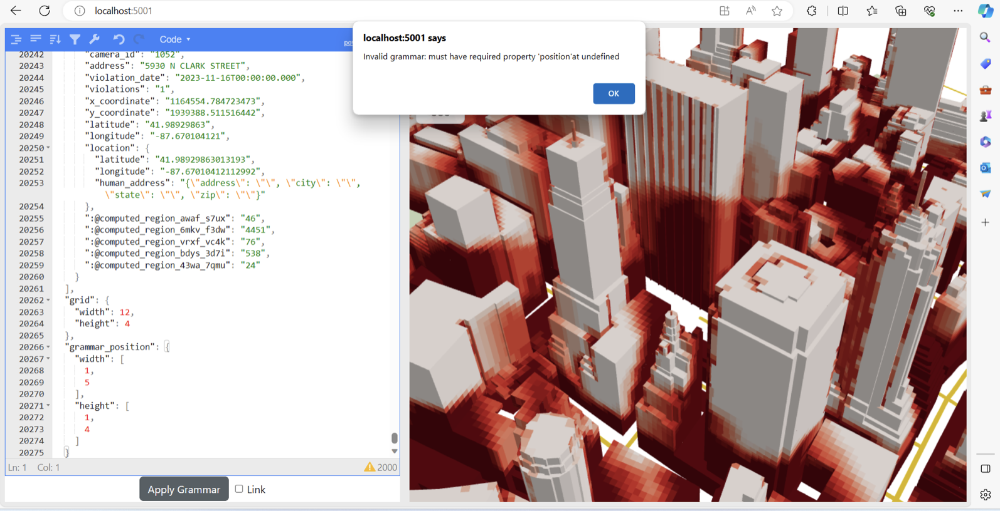
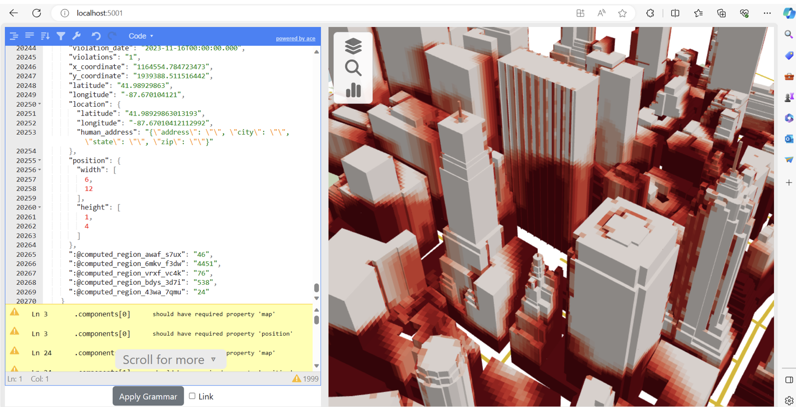

# CS 424: Assigment 4

### Website

https://bvella2.github.io/vis/

Please also have a look at https://crpto-bug.github.io/ which contains all the visualizations which we made that provide clear insights but were not able to make it to the website due to time constraint and integration issues.

### About the Dataset

The dataset we used shows the daily amount of violations created by the City of Chicago Red Light Program for each camera. The data reflects violations that occurred from July 2014 until December 2020, and contains about 800,000 observations for red light violations. The main attributes of interest from the dataset are:

- Intersection
- Violation Date
- Number of Violations
- (Latitude, Longitude) for the Violation location

---

---

### Website Interface

---

###  Visualizations

#### Visualization 1

This visualization allows us to see which junctions have the most violations over time. After regions with large numbers of violations are discovered, this can be very useful in putting further measures in place to lower the number of infractions. When paired with other datasets, this can provide further insights and help us understand how development has affected the frequency of violations registered at a given intersection over time.

The user can click over markers on the map to view the intersection name, and upon clicking a marker, the line chart on the right gets updated showing the number of violations recorded at that intersection. 

There is also aggregation feature where we can select time to yearly/monthly/weekly and the line chart gets updated accordinly for a particular intersection.

---

#### Visualization 2

The bar graph is a linked visualization which is updated with the aggregate feature from above visualization.
A noticeable peak in 2021 and 2016 despite this, the overall count of violations reported has been fairly steady over time. The decrease in city traffic during the lockdown time in 2021 might have been whatever generated the rise, as fewer cars may have led to people jumping traffic signals. However, more information would be necessary to explain the 2016 increase.

---

#### Visualization 3

This is a scatter plot with longitudes and latitudes of camera ID's. It is brushable in which the user can select an area of camera ID from the scatter plot and the chart to right shows total violations of the selected area. 

In comparison to crossings in the north, it is clear that intersections in the south have recorded less red light violations. As we proceed toward the north side, we continue to witness an increase in the number of violations. 

---

#### Visualization 3

This visualization showcases traffic violations in a city over time, with a focus on specific areas and wards. The interactive setup features a line chart and a stacked area chart. The line chart traces annual violations at various addresses, using color to differentiate them and incorporating interactivity that alters line opacity based on user selection. The stacked area chart complements this by displaying the proportional distribution of violations across different wards each year, giving a sense of each area's contribution to the total.

The charts are linked through a multi-selection tool, allowing users to click on elements within one chart to highlight related data in both. This creates a dynamic experience where selections in the area distribution directly affect the temporal violation trends and vice versa.

Uniform dimensions ensure consistency, while an independent color scale for each chart maintains clarity. Together, these charts offer an engaging, layered exploration of violation patterns, blending overall trends with granular, area-specific details.

---

#### UTK

 Migrated to the UTK Framework but encountered some errors which can be seen in the images below.

 

---